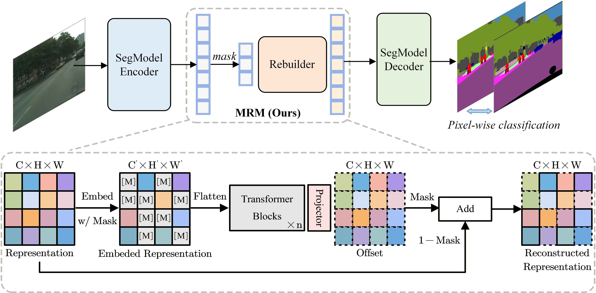

# Masked Representation Modeling for Domain-Adaptive Segmentation

**by Wenlve Zhou, Zhiheng Zhou, Tiantao Xian, Yikui Zhai, Weibin Wu, Biyun MA**

<p align="center">
  
</p>

## Environment Setup

First, please install cuda version 11.0.3 available at [https://developer.nvidia.com/cuda-11-0-3-download-archive](https://developer.nvidia.com/cuda-11-0-3-download-archive). It is required to build mmcv-full later.

For this project, we used python 3.8.5. We recommend setting up a new virtual
environment:

```shell
python -m venv ~/venv/mic-seg
source ~/venv/mic-seg/bin/activate
```

In that environment, the requirements can be installed with:

```shell
pip install -r requirements.txt -f https://download.pytorch.org/whl/torch_stable.html
pip install mmcv-full==1.3.7  # requires the other packages to be installed first
```

Please, download the MiT-B5 ImageNet weights provided by [SegFormer](https://github.com/NVlabs/SegFormer?tab=readme-ov-file#training)
from their [OneDrive](https://connecthkuhk-my.sharepoint.com/:f:/g/personal/xieenze_connect_hku_hk/EvOn3l1WyM5JpnMQFSEO5b8B7vrHw9kDaJGII-3N9KNhrg?e=cpydzZ) and put them in the folder `pretrained/`.

## Dataset Setup

**Cityscapes:** Please, download leftImg8bit_trainvaltest.zip and
gt_trainvaltest.zip from [here](https://www.cityscapes-dataset.com/downloads/)
and extract them to `data/cityscapes`.

**GTA:** Please, download all image and label packages from
[here](https://download.visinf.tu-darmstadt.de/data/from_games/) and extract
them to `data/gta`.

**Synthia (Optional):** Please, download SYNTHIA-RAND-CITYSCAPES from
[here](http://synthia-dataset.net/downloads/) and extract it to `data/synthia`.

**ACDC (Optional):** Please, download rgb_anon_trainvaltest.zip and
gt_trainval.zip from [here](https://acdc.vision.ee.ethz.ch/download) and
extract them to `data/acdc`. Further, please restructure the folders from
`condition/split/sequence/` to `split/` using the following commands:

```shell
rsync -a data/acdc/rgb_anon/*/train/*/* data/acdc/rgb_anon/train/
rsync -a data/acdc/rgb_anon/*/val/*/* data/acdc/rgb_anon/val/
rsync -a data/acdc/gt/*/train/*/*_labelTrainIds.png data/acdc/gt/train/
rsync -a data/acdc/gt/*/val/*/*_labelTrainIds.png data/acdc/gt/val/
```

**Dark Zurich (Optional):** Please, download the Dark_Zurich_train_anon.zip
and Dark_Zurich_val_anon.zip from
[here](https://www.trace.ethz.ch/publications/2019/GCMA_UIoU/) and extract it
to `data/dark_zurich`.

The final folder structure should look like this:

```none
DAFormer
├── ...
├── data
│   ├── acdc (optional)
│   │   ├── gt
│   │   │   ├── train
│   │   │   ├── val
│   │   ├── rgb_anon
│   │   │   ├── train
│   │   │   ├── val
│   ├── cityscapes
│   │   ├── leftImg8bit
│   │   │   ├── train
│   │   │   ├── val
│   │   ├── gtFine
│   │   │   ├── train
│   │   │   ├── val
│   ├── dark_zurich (optional)
│   │   ├── gt
│   │   │   ├── val
│   │   ├── rgb_anon
│   │   │   ├── train
│   │   │   ├── val
│   ├── gta
│   │   ├── images
│   │   ├── labels
│   ├── synthia (optional)
│   │   ├── RGB
│   │   ├── GT
│   │   │   ├── LABELS
├── ...
```

**Data Preprocessing:** Finally, please run the following scripts to convert the label IDs to the
train IDs and to generate the class index for RCS:

```shell
python tools/convert_datasets/gta.py data/gta --nproc 8
python tools/convert_datasets/cityscapes.py data/cityscapes --nproc 8
python tools/convert_datasets/synthia.py data/synthia/ --nproc 8
```

## Training

For convenience, we provide an [annotated config file](configs/mic/gtaHR2csHR_mic_hrda.py)
of the final MRM+DACS on GTA→Cityscapes and synthia→Cityscapes. A training job can be launched using:

```shell
python run_experiments.py --config configs/gta2cs_dacs_mrm_dlv2.py
```

```shell
python run_experiments.py --config configs/syn2cs_dacs_mrm_dlv2.py
```

The logs and checkpoints are stored in `work_dirs/`.

## Evaluation

A trained model can be evaluated using:

```shell
sh test.sh work_dirs/run_name/
```

The predictions are saved for inspection to
`work_dirs/run_name/preds`
and the mIoU of the model is printed to the console.

When training a model on Synthia→Cityscapes, please note that the
evaluation script calculates the mIoU for all 19 Cityscapes classes. However,
Synthia contains only labels for 16 of these classes. Therefore, it is a common
practice in UDA to report the mIoU for Synthia→Cityscapes only on these 16
classes. As the Iou for the 3 missing classes is 0, you can do the conversion
`mIoU16 = mIoU19 * 19 / 16`.

The results for Cityscapes→ACDC and Cityscapes→DarkZurich are reported on
the test split of the target dataset. To generate the predictions for the test
set, please run:

```shell
python -m tools.test path/to/config_file path/to/checkpoint_file --test-set --format-only --eval-option imgfile_prefix=labelTrainIds to_label_id=False
```

The predictions can be submitted to the public evaluation server of the
respective dataset to obtain the test score.

## Framework Structure

This project is based on [mmsegmentation version 0.16.0](https://github.com/open-mmlab/mmsegmentation/tree/v0.16.0).
For more information about the framework structure and the config system,
please refer to the [mmsegmentation documentation](https://mmsegmentation.readthedocs.io/en/latest/index.html)
and the [mmcv documentation](https://mmcv.readthedocs.ihttps://arxiv.org/abs/2007.08702o/en/v1.3.7/index.html).

The most relevant files for MRM are:

* [configs/gta2cs_dacs_mrm_dlv2.py](configs/gta2cs_dacs_mrm_dlv2.py):
  Annotated config file for MRM+DACS on GTA→Cityscapes.
* [configs/syn2cs_dacs_mrm_dlv2.py](configs/syn2cs_dacs_mrm_dlv2.py):
  Annotated config file for MRM+DACS on Synthia→Cityscapes.
* [mmseg/models/Rebuilder.py](mmseg/models/Rebuilder.py):
  Architecture of Rebuilder.
* [mmseg/models/segmentors/encoder_decoder.py](mmseg/models/segmentors/encoder_decoder.py):
  Integrate Masked Representation Modeling into the baseline code, as detailed in the mrm_training function.
* [mmseg/models/segmentors/hrda_encoder_decoder.py](mmseg/models/segmentors/hrda_encoder_decoder.py):
  Integrate Masked Representation Modeling into the baseline code, as detailed in the mrm_training function.
* [mmseg/models/uda/dacs.py](mmseg/models/uda/dacs.py):
  Integrate Masked Representation Modeling (MRM) into the baseline code, including subtle implementation details such as RAM optimization.

## Acknowledgements

MRM is based on the following open-source projects. We thank their
authors for making the source code publicly available.

* [HRDA](https://github.com/lhoyer/HRDA)
* [DAFormer](https://github.com/lhoyer/DAFormer)
* [MMSegmentation](https://github.com/open-mmlab/mmsegmentation)
* [SegFormer](https://github.com/NVlabs/SegFormer)
* [DACS](https://github.com/vikolss/DACS)
