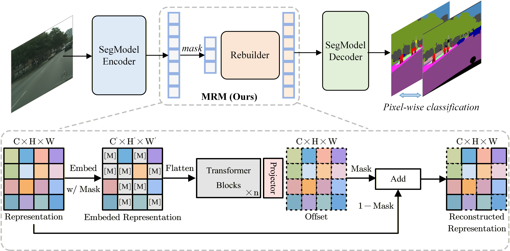

# Masked Representation Modeling for Domain-Adaptive Segmentation

Official partial release for the CVPR 2026 paper. [[Paper]](https://openaccess.thecvf.com/content/CVPR2026/papers/Zhou_Masked_Representation_Modeling_for_Domain-Adaptive_Segmentation_CVPR_2026_paper.pdf) [[Arxiv]](https://arxiv.org/abs/2509.13801)

**Masked Representation Modeling for Domain-Adaptive Segmentation**   
Wenlve Zhou, Zhiheng Zhou, Tiantao Xian, Yikui Zhai, Weibin Wu, Biyun Ma 


<p align="center">
  
</p>

## What Is Released

This repository provides a minimal implementation of the **Rebuilder** used in
Masked Representation Modeling (MRM). The full training framework is not
included in this partial release.

The Rebuilder is an auxiliary module for training. It masks encoder
representations, reconstructs the masked parts, and sends the rebuilt features
back to the original segmentation decoder. It is removed during inference, so
MRM adds no test-time overhead.

```text
image -> encoder -> features -> Rebuilder -> rebuilt features -> decoder -> MRM loss
```

## Example

### DAFormer-style multi-scale features

```python
import torch
from rebuilder import Rebuilder

cfg = {
    "type": "DAFormerHead",
    "in_channels": [64, 128, 320, 512],
    "in_index": [0, 1, 2, 3],
}

rebuilder = Rebuilder(cfg)

features = [
    torch.rand(1, 64, 128, 128),
    torch.rand(1, 128, 64, 64),
    torch.rand(1, 320, 32, 32),
    torch.rand(1, 512, 16, 16),
]

rebuilt_features = rebuilder(features)
```

`rebuilt_features` is a list with the same feature scales expected by a
DAFormer-style decode head:

```text
[
  rebuilt_feat_1: [B, 64, 128, 128],
  rebuilt_feat_2: [B, 128, 64, 64],
  rebuilt_feat_3: [B, 320, 32, 32],
  rebuilt_feat_4: [B, 512, 16, 16],
]
```

## MRM Loss in MMSegmentation Framework

MRM uses the same pixel-wise segmentation loss as the main segmentation branch,
but the supervision comes from target-domain pseudo labels.

```python
from rebuilder import Rebuilder
```

Pass the same decoder-head config fields used by your segmentation model:

```python
rebuilder = Rebuilder({
    "type": "DAFormerHead",
    "in_channels": [64, 128, 320, 512],
    "in_index": [0, 1, 2, 3],
})
```

```python
# MRM branch.
rebuilt_features = rebuilder(target_features)
mrm_losses = model._decode_head_forward_train(
    rebuilt_features,
    img_metas,
    pseudo_label,
    seg_weight=pseudo_weight,
)
```

`_decode_head_forward_train` returns a loss dictionary in MMSegmentation. Add
the MRM losses to your original training losses with a new prefix or a separate
weight:

```python
losses = {}
losses.update(source_losses)
losses.update(uda_losses)

for name, value in mrm_losses.items():
    losses[f"mrm.{name}"] = lambda_mrm * value
```

During inference, use only the original segmentation model:

```python
pred = model(img)
```

## Citation

```bibtex
@inproceedings{zhou2026mrm,
  title={Masked Representation Modeling for Domain-Adaptive Segmentation},
  author={Zhou, Wenlve and Zhou, Zhiheng and Xian, Tiantao and Zhai, Yikui and Wu, Weibin and Ma, Biyun},
  booktitle={Proceedings of the IEEE/CVF Conference on Computer Vision and Pattern Recognition},
  year={2026}
}
```
